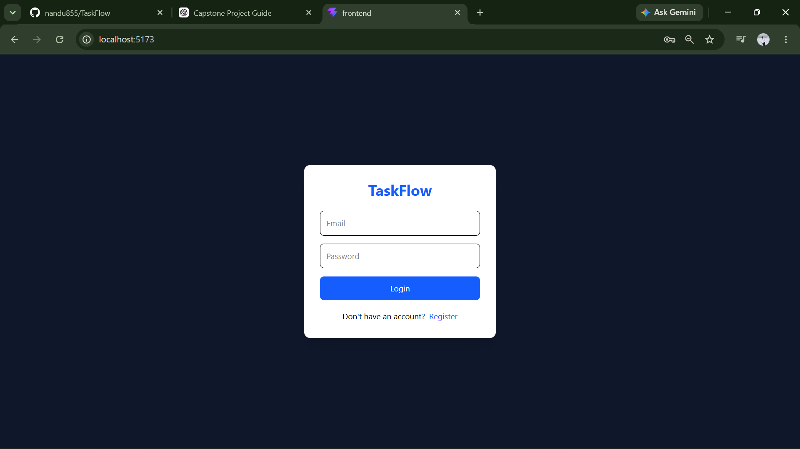
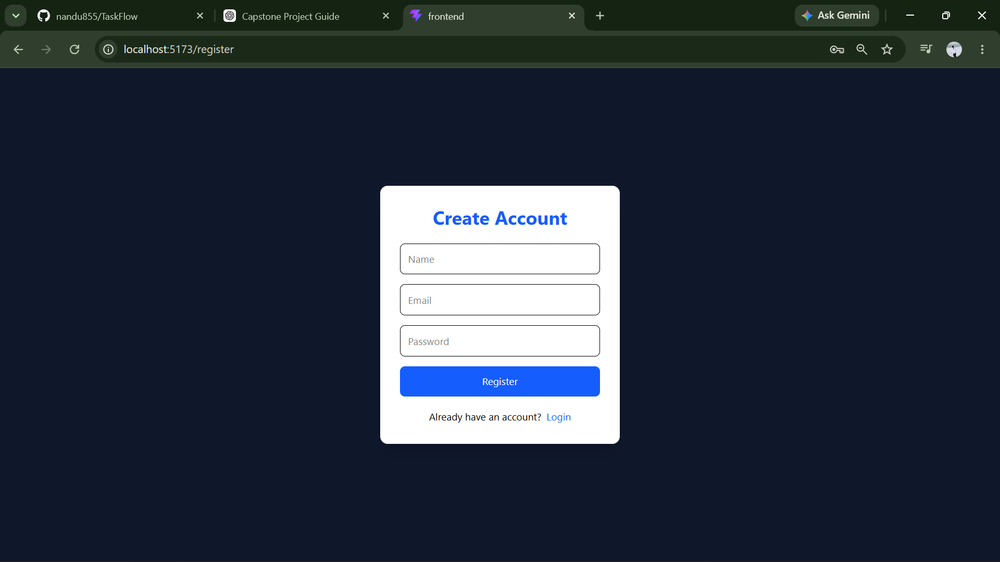
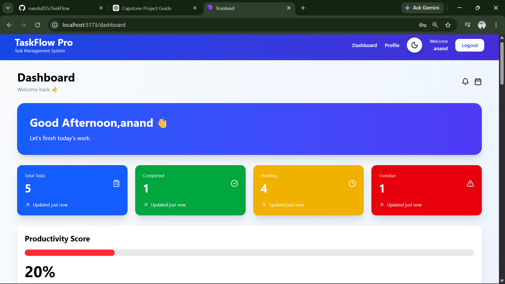
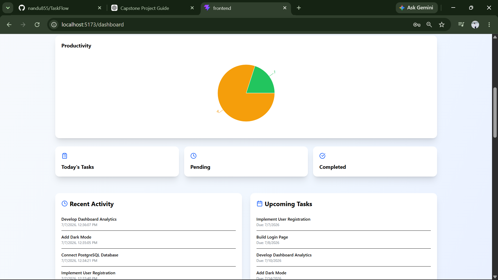
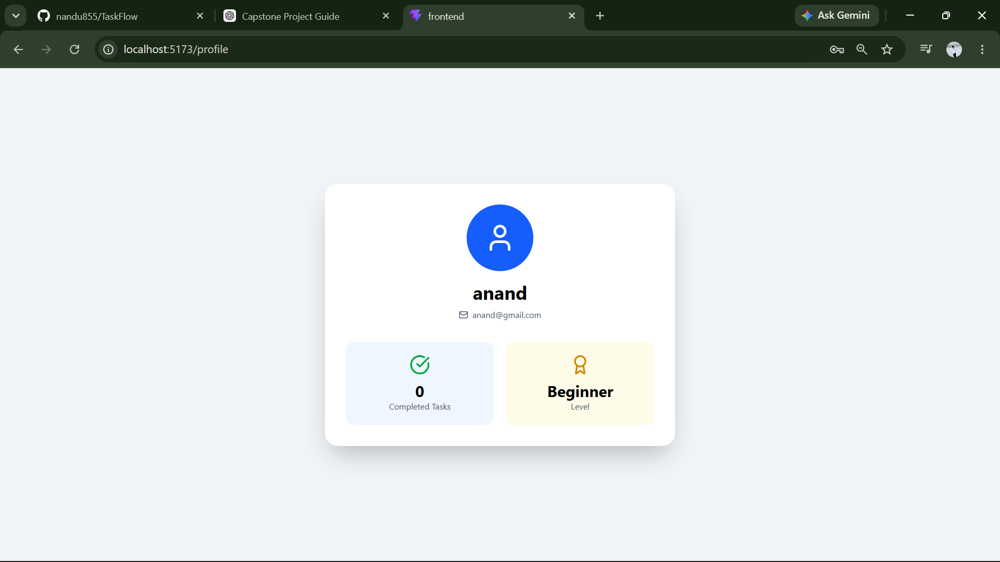

# 🚀 TaskFlow – Task Management System

A modern **Full-Stack Task Management Application** built using **React, TypeScript, Express.js, PostgreSQL, Prisma ORM, and JWT Authentication**.

It helps users organize daily tasks, monitor productivity, and manage work efficiently through a clean and responsive dashboard.

---

# 📌 Features

## 🔐 Authentication

- User Registration
- User Login
- JWT Authentication
- Protected Routes
- Secure Password Hashing (bcrypt)

---

## ✅ Task Management

- Create Tasks
- Edit Tasks
- Delete Tasks
- Search Tasks
- Filter Tasks
- Task Status (Pending / Completed)
- Task Priorities
- Categories
- Due Dates

---

## 📊 Dashboard

- Welcome Section
- Analytics Cards
- Productivity Score
- Task Statistics
- Pie Chart
- Recent Activity
- Upcoming Tasks
- Responsive Dashboard

---

# 🛠 Tech Stack

## Frontend

- React
- TypeScript
- Vite
- Tailwind CSS
- Axios
- React Router
- Recharts
- Framer Motion
- Lucide React
- React Hot Toast

---

## Backend

- Node.js
- Express.js
- TypeScript
- Prisma ORM
- JWT Authentication
- bcryptjs

---

## Database

- PostgreSQL

---

# 📂 Project Structure

```text
TaskFlow/
│
├── backend/
│   ├── prisma/
│   ├── src/
│   ├── package.json
│   └── .env.example
│
├── frontend/
│   ├── public/
│   ├── src/
│   ├── package.json
│   └── vite.config.ts
│
├── screenshots/
│   ├── login.png
│   ├── register.png
│   ├── dashboard.png
│   ├── task-management.png
│   ├── analytics.png
│   └── profile.png
│
├── README.md
└── .gitignore
```

---

# 🗄 Database Schema

## User

| Field | Type |
|-------|------|
| id | String |
| name | String |
| email | String |
| password | String |

---

## Task

| Field | Type |
|-------|------|
| id | String |
| title | String |
| description | String |
| status | String |
| priority | String |
| category | String |
| dueDate | DateTime |
| createdAt | DateTime |
| updatedAt | DateTime |
| userId | String |

---

# 📷 Application Screenshots

## 🔐 Login Page

Secure login using JWT Authentication.



---

## 📝 Register Page

Create a new account.



---

## 📊 Dashboard

Dashboard displaying analytics cards, productivity score, charts, and statistics.



---

## ✅ Task Management

Create, update, search, filter, and delete tasks.


---

## 📈 Analytics

Task analytics, recent activity, and upcoming tasks.



---

## 👤 Profile

User profile page.



---

# ⚙ Installation

## 1. Clone Repository

```bash
git clone https://github.com/nandu855/TaskFlow.git
```

---

## 2. Backend Setup

```bash
cd backend

npm install

npx prisma generate

npx prisma migrate dev

npm run dev
```

---

## 3. Frontend Setup

Open another terminal.

```bash
cd frontend

npm install

npm run dev
```

---

# 🔑 Environment Variables

Create a `.env` file inside the **backend** folder.

```env
DATABASE_URL=your_postgresql_database_url

JWT_SECRET=your_secret_key

PORT=4000
```

---

# 🚀 API Endpoints

## Authentication

| Method | Endpoint |
|---------|----------|
| POST | /api/auth/register |
| POST | /api/auth/login |

---

## Tasks

| Method | Endpoint |
|---------|----------|
| GET | /api/tasks |
| POST | /api/tasks |
| PUT | /api/tasks/:id |
| DELETE | /api/tasks/:id |

---

# ✨ Future Enhancements

- Team Collaboration
- Calendar View
- Email Notifications
- Recurring Tasks
- File Attachments
- AI Task Suggestions
- Mobile Application

---

# 🎯 Learning Outcomes

- React & TypeScript
- Express.js REST APIs
- JWT Authentication
- Prisma ORM
- PostgreSQL Integration
- Responsive UI Design
- State Management
- CRUD Operations
- Full-Stack Development

---

# 👨‍💻 Author

**Anand Kumar Badarala**

Bachelor of Computer Applications (BCA)

Capstone Project – 2026

GitHub: https://github.com/nandu855

---

# 📄 License

This project was developed for educational and academic purposes.