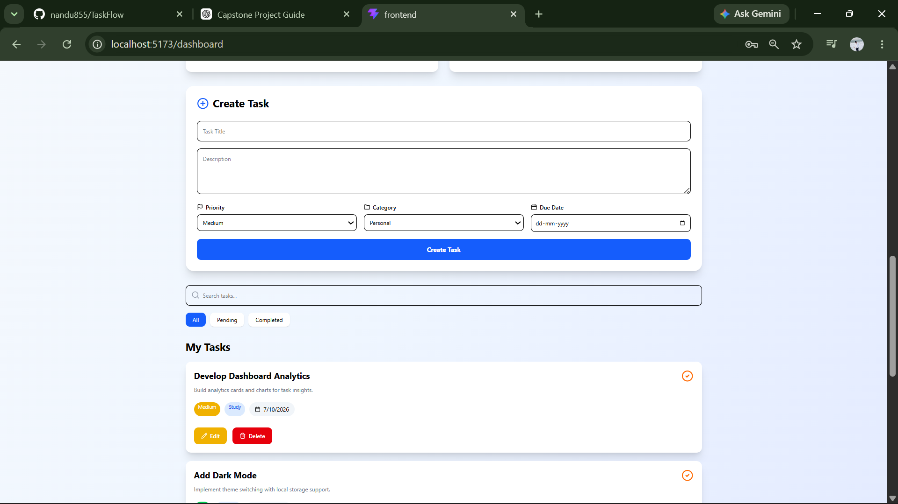

# 🚀 TaskFlow Pro


A modern **Full Stack Task Management System** built using **React, TypeScript, Express.js, Prisma ORM, PostgreSQL, and JWT Authentication**.

TaskFlow Pro helps users efficiently organize, track, and manage daily tasks with an intuitive dashboard, analytics, secure authentication, and productivity insights.

---

# 📌 Project Overview

TaskFlow Pro is a web-based productivity application that enables users to:

- Securely register and log in
- Create, update, and delete tasks
- Organize tasks using categories and priorities
- Track progress through analytics
- Monitor upcoming tasks
- Improve productivity using dashboard insights

The project demonstrates modern full-stack web development using React, Express, Prisma ORM, PostgreSQL, and JWT authentication.

---

# ✨ Features

## 🔐 Authentication

- User Registration
- User Login
- JWT Authentication
- Protected Routes
- Secure Password Hashing (bcrypt)
- Logout

---

## ✅ Task Management

- Create Tasks
- Edit Tasks
- Delete Tasks
- Search Tasks
- Task Status Management
- Priority Levels
- Categories
- Due Dates

---

## 📊 Dashboard

- Welcome Banner
- Analytics Cards
- Productivity Score
- Task Statistics
- Pie Chart
- Recent Activity
- Upcoming Tasks
- Quick Actions

---

## 🎨 User Interface

- Responsive Design
- Toast Notifications
- Modern Dashboard
- Clean UI
- Animated Components
- Professional Layout

---

# 🛠 Tech Stack

## Frontend

- React
- TypeScript
- Vite
- Tailwind CSS
- Recharts
- Framer Motion
- React Hot Toast
- Lucide React

---

## Backend

- Node.js
- Express.js
- Prisma ORM
- JWT Authentication
- bcryptjs

---

## Database

- PostgreSQL

---

# 📂 Project Structure

```
TaskFlow/
│
├── backend/
│   ├── prisma/
│   ├── src/
│   │   ├── config/
│   │   ├── controllers/
│   │   ├── middlewares/
│   │   ├── routes/
│   │   └── server.ts
│   │
│   └── package.json
│
├── frontend/
│   ├── src/
│   │   ├── api/
│   │   ├── components/
│   │   ├── context/
│   │   ├── hooks/
│   │   ├── pages/
│   │   ├── types/
│   │   └── main.tsx
│   │
│   └── package.json
│
├── screenshots/
│
└── README.md
```

---

# 🔐 Authentication Flow

```
User

↓

Register / Login

↓

JWT Token Generated

↓

Protected Routes

↓

Dashboard

↓

Task Management
```

---

# 🗄 Database Schema

## User

| Field | Type |
|--------|------|
| id | String |
| name | String |
| email | String |
| password | String |

---

## Task

| Field | Type |
|--------|------|
| id | String |
| title | String |
| description | String |
| status | String |
| priority | String |
| category | String |
| dueDate | DateTime |
| createdAt | DateTime |
| updatedAt | DateTime |
| userId | String |

---

# 📷 Application Screenshots

## 🔐 Login Page

Secure login using JWT authentication.


---

## 📝 Register Page

Create a new user account.


---

## 📊 Dashboard

Displays analytics cards, productivity score, charts, and overall task statistics.


---

## ✅ Task Management

Create, update, delete, search, and manage tasks using priorities, categories, statuses, and due dates.



---

## 📈 Analytics

Visual representation of completed and pending tasks along with recent activity and upcoming tasks.


---

## 👤 User Profile

Displays user information and profile details.


---

# ⚙ Installation

## Clone Repository

```bash
git clone https://github.com/YOUR_GITHUB_USERNAME/TaskFlow.git
```

---

## Backend Setup

```bash
cd backend

npm install

npx prisma generate

npx prisma migrate dev

npm run dev
```

---

## Frontend Setup

```bash
cd frontend

npm install

npm run dev
```

---

# 🔑 Environment Variables

Create a `.env` file inside the backend directory.

```env
DATABASE_URL=your_database_url

JWT_SECRET=your_secret_key

PORT=4000
```

---

# 🚀 Future Enhancements

- Team Collaboration
- Calendar View
- Email Notifications
- File Attachments
- AI Task Suggestions
- Mobile Application
- Recurring Tasks
- Workspace Management

---

# 🎯 Learning Outcomes

- React Hooks
- TypeScript
- REST API Development
- JWT Authentication
- Prisma ORM
- PostgreSQL
- Responsive UI Development
- Dashboard Analytics
- State Management
- Secure Backend Development

---

# 👨‍💻 Author

**Your Name**

Bachelor of Computer Applications (BCA)

Academic Project – 2026

---

# 📄 License

This project was developed for educational and academic purposes.